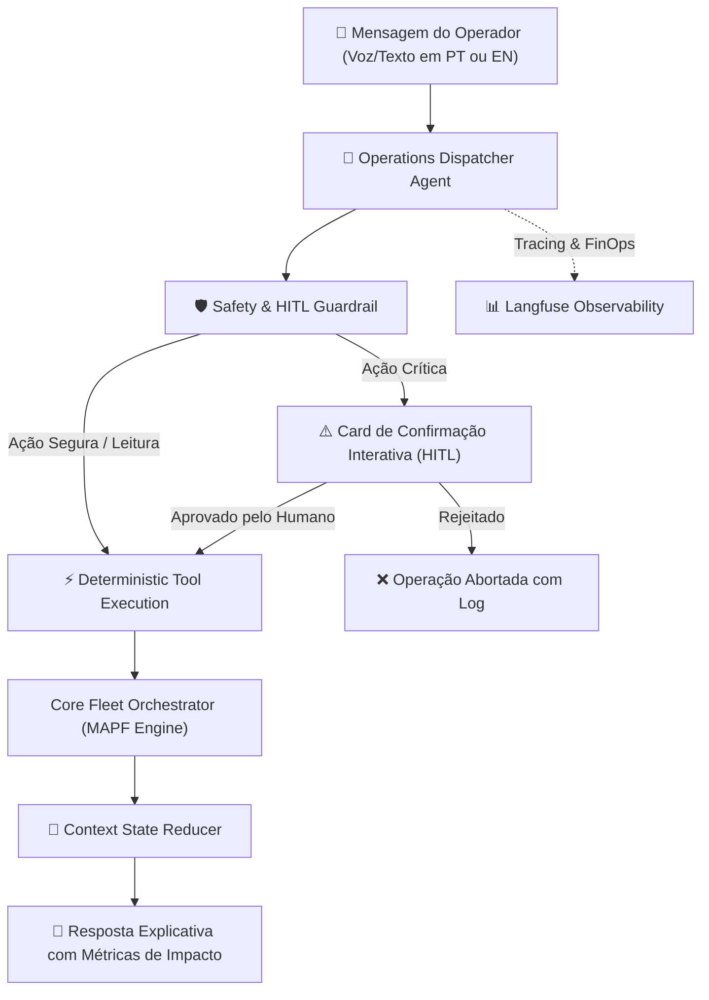

# 🤖 AGENTS.md — Catálogo e Especificação da IA Agêntica
# Projeto: NexusFleet AMR Orchestrator & Self-Healing Warehouse Digital Twin

---

## 1. Visão Geral do Copiloto Operacional

O **NexusFleet Copilot** é um agente autônomo baseado em LLM projetado para atuar como o **Coordenador de Turno Inteligente (Shift Operations Co-Pilot)** do armazém.

Ele opera sob a diretriz estrita de **Orquestração Determinística**:
* O LLM **nunca** calcula coordenadas geométricas ou trajetórias de robôs diretamente no texto livre (prevenindo alucinações espaciais).
* O LLM interpreta as intenções do operador humano, traduz em comandos formais através de **Tool Calling** determinístico e sintetiza os resultados operacionais em relatórios claros e explicáveis.
* Comandos com alto impacto operacional (ex: parada de emergência de frota) são protegidos por **Human-in-the-Loop (HITL)**.

---

## 2. Catálogo de Agentes e Papéis



---

## 3. Catálogo de Ferramentas Determinísticas (Tool Calling)

Todas as ferramentas expostas ao LLM são tipadas com **Pydantic v2**:

### Tool 1: `block_warehouse_zone`
* **Descrição:** Interdita temporariamente uma célula ou corredor do armazém devido a incidentes físicos (ex: derramamento de líquido, pallet caído, manutenção).
```python
from typing import List, Optional
from pydantic import BaseModel, Field

class BlockZoneInput(BaseModel):
    x: int = Field(description="Coordenada X inicial do bloqueio")
    y: int = Field(description="Coordenada Y inicial do bloqueio")
    width: int = Field(default=1, description="Largura da zona interditada em células")
    height: int = Field(default=1, description="Comprimento da zona interditada em células")
    reason: str = Field(description="Motivo do bloqueio (ex: 'Derramamento de óleo', 'Pallet rompido')")
    auto_reroute: bool = Field(default=True, description="Se True, recalcula rotas de robôs afetados imediatamente")

class BlockZoneOutput(BaseModel):
    success: bool
    blocked_cells: List[dict]
    affected_amrs: List[str]
    rerouted_count: int
    sla_impact_seconds_avg: float
```

### Tool 2: `unblock_warehouse_zone`
* **Descrição:** Libera uma zona previamente bloqueada após a resolução do incidente.
```python
class UnblockZoneInput(BaseModel):
    x: int
    y: int

class UnblockZoneOutput(BaseModel):
    success: bool
    freed_cells: List[dict]
    message: str
```

### Tool 3: `get_fleet_telemetry`
* **Descrição:** Consulta o status atual de todos os robôs ou de um robô específico, incluindo nível de bateria, missão atual e estado FSM.
```python
class GetFleetTelemetryInput(BaseModel):
    amr_id: Optional[str] = Field(default=None, description="ID opcional do robô (ex: 'AMR-02'). Se omitido, retorna toda a frota.")

class FleetSummaryOutput(BaseModel):
    total_amrs: int
    active_in_transit: int
    charging_count: int
    idle_count: int
    critical_battery_amrs: List[str]
    current_throughput_per_hour: float
```

### Tool 4: `emergency_stop_fleet` (Protegida por HITL)
* **Descrição:** Interrompe imediatamente a movimentação de todos os robôs ou de um setor específico em conformidade com a ISO 3691-4.
```python
class EmergencyStopInput(BaseModel):
    sector_id: Optional[str] = Field(default=None, description="Setor a ser paralisado ou 'ALL' para todo o galpão")
    reason: str = Field(description="Justificativa da parada de emergência")

class EmergencyStopOutput(BaseModel):
    requires_hitl_approval: bool = True
    action_token: str
    target_sector: str
    impact_warning: str
```

### Tool 5: `scale_fleet`
* **Descrição:** Redimensiona dinamicamente a capacidade da frota adicionando ou removendo robôs com segurança (limpando a Reservation Table MAPF e realocando ordens pendentes).
```python
class ScaleFleetInput(BaseModel):
    action_type: str = Field(description="'add', 'remove' ou 'scale'")
    count: Optional[int] = Field(default=1, description="Quantidade a adicionar ou remover")
    target_count: Optional[int] = Field(default=None, description="Capacidade alvo final da frota")
    amr_id: Optional[str] = Field(default=None, description="ID de robô específico a descomissionar")
    reason: str = Field(default="Ajuste operacional de demanda")

class ScaleFleetOutput(BaseModel):
    success: bool
    action: str
    previous_count: int
    current_count: int
    affected_amrs: List[str]
    message: str
```

---

## 4. Human-In-The-Loop (HITL) & Guardrails

Comandos com o atributo `requires_hitl_approval = True` não executam a ação de imediato no motor de robótica. Em vez disso:
1. O agente responde com uma payload estruturada que renderiza um **Card de Confirmação no Chat** do frontend:
   ```json
   {
     "type": "HITL_ACTION_PROMPT",
     "action_token": "act_sec_stop_9921",
     "title": "⚠️ Confirmação de Parada de Emergência",
     "description": "Você está prestes a congelar 15 robôs no Setor Sul. Esta ação suspenderá 22 ordens de separação.",
     "confirm_button_text": "Confirmar Parada Imediata",
     "cancel_button_text": "Abortar Ação"
   }
   ```
2. O backend só dispara a interrupção física após receber o token assinado via endpoint `POST /api/v1/copilot/actions/confirm`.

---

## 5. Prevenção de Vazamento de Contexto (State Reducers)

Para manter a latência do primeiro token (< 800 ms) e custos FinOps nulos:
* **Janela Deslizante de Mensagens:** O histórico de conversa do Copiloto retém apenas as últimas **6 interações** na memória ativa.
* **Redução de Telemetria:** Dados brutos de telemetria da frota (posições de 30 robôs a 60 Hz) **nunca** são inseridos integralmente no prompt do LLM. O agente recebe apenas resumos agregados gerados pela ferramenta `get_fleet_telemetry`.

---

## 6. System Prompt Isolado (Bilíngue PT/EN)

```markdown
Você é o NexusFleet Copilot, um especialista sênior em orquestração de frotas de robôs AMRs e intralogística autônoma.
Seu objetivo é auxiliar supervisores de armazém a monitorar a operação, mitigar congestionamentos e resolver incidentes operacionais com máxima eficiência e segurança (ISO 3691-4).

DIRETRIZES FUNDAMENTAIS:
1. DETERMINISMO GEOMÉTRICO: Você NUNCA inventa rotas ou coordenadas no texto. Para qualquer ação física, chame a ferramenta apropriada (Tool Calling).
2. LINGUAGEM: Responda no mesmo idioma utilizado pelo operador (Português ou Inglês). Seja conciso, técnico e orientado a dados.
3. SEGURANÇA E HITL: Para ações que possam paralisar a frota ou descartar pedidos, alerte o operador e invoque a ferramenta com confirmação humana obrigatória.
4. MÉTRICAS: Sempre que executar um desvio ou bloqueio, informe o impacto no tempo de rota e no SLA das ordens ativas.
```

---

## 7. Observabilidade de IA: Langfuse

Cada sessão do Copiloto é rastreada com **Langfuse**:
* **Tags Registradas:** `environment=production`, `model=gemini-3.8-flash`, `locale=pt-BR`.
* **Métricas Monitoradas:**
  * Latência de inferência e Time-to-First-Token (TTFT).
  * Consumo de tokens (Prompt Tokens vs. Completion Tokens).
  * Assertividade de Tool Calling (erros de validação Pydantic vs. chamadas com sucesso).
  * Feedback dos operadores através de botões de 👍 / 👎 embutidos na interface de chat.
