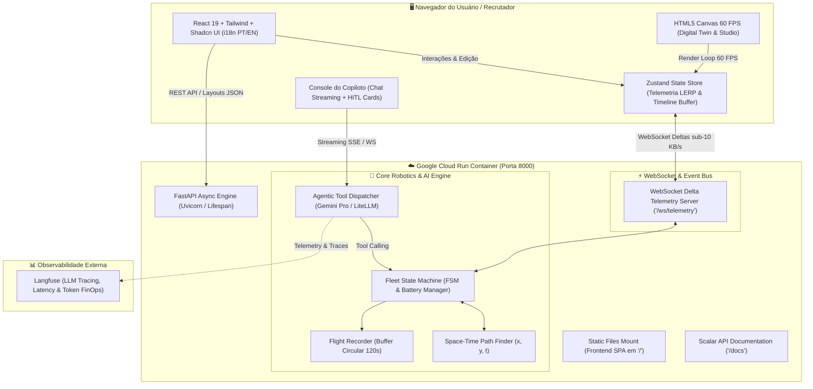

# 🏗️ PROJECT_SPEC — Especificação Técnica
# Projeto: NexusFleet AMR Orchestrator & Self-Healing Warehouse Digital Twin

---

## 1. Topologia de Software & Arquitetura Geral

O **NexusFleet AMR** adota o padrão de **Monólito Conteinerizado Unificado (Single-Container Full-Stack)**, desacoplado internamente entre um Backend de alta performance em Python assíncrono e um Frontend SPA reativo em React 19 / TypeScript com HTML5 Canvas.



---

## 2. Decisões Arquiteturais de Engenharia (ADRs)

### ADR-01: Transição de Q-Learning Tabular para Space-Time MAPF ($x, y, t$)
* **Contexto:** A implementação legada utilizava Q-Learning tabular com 12 nós. Para múltiplos robôs e grids configuráveis ($20 \times 20$ até $40 \times 40$), o Q-Learning tabular sofre de explosão combinatória de estados ($O(S^N)$ onde $N$ é o número de robôs) e não oferece garantias formais contra colisões.
* **Decisão:** Implementar o algoritmo **Space-Time A\*** combinado com **Reservation Table (Malha de Reserva Espaço-Temporal)** e priorização de conflitos (*Conflict-Based Search - CBS* leve).
* **Consequências:**
  * Garantia matemática de zero colisões de vértice $(x, y, t)$ e de aresta $((x_1, y_1) \leftrightarrow (x_2, y_2))$.
  * Tempo de resolução de rota em $< 20\text{ ms}$ por agente.
  * Capacidade de suportar 30+ agentes simultâneos em tempo real.

### ADR-02: Substituição Expressa de Streamlit por React 19 + Canvas 2D
* **Contexto:** Streamlit re-executa o script inteiro a cada interação, não suporta animações contínuas a 60 FPS, não permite manipulação fluida de Canvas para drag-and-drop e passa imagem de protótipo acadêmico.
* **Decisão:** Construir o frontend em **React 19 com TypeScript estrito, Tailwind CSS, Shadcn UI, Zustand e HTML5 Canvas com `requestAnimationFrame`**.
* **Consequências:**
  * 60 FPS estáveis com interpolação suave (LERP) entre posições dos robôs.
  * O editor *Warehouse Layout Studio* permite pintar corredores e arrastar elementos com resposta em $< 16\text{ ms}$.
  * Padrão visual alinhado às startups globais do Vale do Silício.

### ADR-03: Single-Container Full-Stack no Google Cloud Run (Scale-to-Zero)
* **Contexto:** Hospedar frontend e backend em serviços gratuitos separados (como Vercel + Render) introduz cold start de 45 segundos e bloqueios de CORS. Servidores pagos dedicados (como Azure B1) geram custos mensais desnecessários para um portfólio.
* **Decisão:** Unificar a compilação do frontend estático e o runtime do FastAPI em um único Dockerfile multi-stage hospedado no **Google Cloud Run com `min-instances = 0`**.
* **Consequências:**
  * Custo operacional de **R$ 0,00 / mês** (consumindo a cota Always Free de 2 milhões de requisições/mês).
  * Cold start de apenas $1.5$ a $2.5$ segundos (tecnologia gVisor do Google).
  * Zero problemas de CORS, com frontend servido na mesma origem.

### ADR-04: Documentação Viva com Scalar (Proibição de Swagger UI)
* **Contexto:** Swagger UI tradicional possui visual obsoleto e baixa interatividade.
* **Decisão:** Integrar o **Scalar** (`scalar-fastapi`) na rota `/docs`.
* **Consequências:** Interface moderna estilo Stripe/Vercel, suporte a temas Dark/Light, cliente HTTP interativo integrado e gerador de snippets em cURL, Python, JavaScript e Go.

### ADR-05: Copiloto de IA com Tool Calling Determinístico & Langfuse Tracing
* **Contexto:** LLMs não devem calcular trajetórias geométricas diretamente devido a risco de alucinação.
* **Decisão:** O Copiloto atua como orquestrador, invocando ferramentas determinísticas do motor de robótica. Todas as chamadas são monitoradas via **Langfuse** para rastreamento de custos, latência e avaliação contínua.

---

## 3. Modelagem do Algoritmo Space-Time MAPF

### 3.1. Tabela de Reserva Espaço-Temporal
A Reservation Table $\mathcal{R}$ mapeia tuplas de espaço-tempo para o identificador do agente que reservou aquele espaço:
$$\mathcal{R}: (x, y, t) \mapsto \text{agent\_id}$$

### 3.2. Condições de Não-Colisão
Para quaisquer dois agentes $i$ e $j$ em qualquer instante de tempo $t$:
1. **Conflito de Vértice (Mesma Célula):**
   $$\text{pos}_i(t) \neq \text{pos}_j(t)$$
2. **Conflito de Aresta (Troca Direta de Posição / Colisão Frontal):**
   $$\neg \left( \text{pos}_i(t) = \text{pos}_j(t+1) \;\land\; \text{pos}_i(t+1) = \text{pos}_j(t) \right)$$

---

## 4. Contratos de Dados (Schemas Pydantic v2)

### 4.1. Layout do Armazém (`WarehouseLayout`)
```python
from enum import Enum
from typing import List, Optional
from pydantic import BaseModel, Field

class CellType(str, Enum):
    EMPTY = "empty"
    POD = "pod"
    PICKING_STATION = "picking_station"
    CHARGING_DOCK = "charging_dock"
    OBSTACLE = "obstacle"

class CellCoordinate(BaseModel):
    x: int = Field(ge=0)
    y: int = Field(ge=0)

class StoragePod(BaseModel):
    id: str
    x: int
    y: int
    sku_category: str = "Geral"
    item_count: int = 100

class WarehouseLayout(BaseModel):
    name: str = "Layout Customizado"
    width: int = Field(default=25, ge=10, le=50)
    height: int = Field(default=25, ge=10, le=50)
    charging_docks: List[CellCoordinate] = []
    picking_stations: List[CellCoordinate] = []
    pods: List[StoragePod] = []
    obstacles: List[CellCoordinate] = []
```

### 4.2. Telemetria do Robô (`AMRTelemetry`)
```python
class AMRState(str, Enum):
    IDLE = "IDLE"
    MOVING_TO_POD = "MOVING_TO_POD"
    LIFTING_POD = "LIFTING_POD"
    TRANSITING_TO_PICKING = "TRANSITING_TO_PICKING"
    AT_PICKING_STATION = "AT_PICKING_STATION"
    RETURNING_POD = "RETURNING_POD"
    LOWERING_POD = "LOWERING_POD"
    CHARGING = "CHARGING"
    AVOIDING_DEADLOCK = "AVOIDING_DEADLOCK"

class AMRTelemetry(BaseModel):
    id: str
    x: float
    y: float
    target_x: Optional[int] = None
    target_y: Optional[int] = None
    state: AMRState
    battery_level: float = Field(ge=0.0, le=100.0)
    carrying_pod_id: Optional[str] = None
    current_mission_id: Optional[str] = None
    planned_path: List[CellCoordinate] = []
```

### 4.3. Pacote de Telemetria WebSocket (`SimulationTickDelta`)
```python
class SimulationTickDelta(BaseModel):
    tick: int
    timestamp_ms: int
    active_amrs: List[AMRTelemetry]
    dynamic_blocks: List[CellCoordinate]
    throughput_items_per_hour: float
    fleet_utilization_pct: float
```

---

## 5. Estrutura de Diretórios Alvo

```
warehouse_routing/
├── PRD.md                             # Documento de Requisitos de Produto
├── PROJECT_SPEC.md                    # Esta especificação técnica viva
├── AGENTS.md                          # Catálogo de ferramentas e prompts do Copiloto
├── TASKS.md                           # Roadmap de execução em checklist
├── README.md                          # Apresentação executiva e quickstart
├── .pre-commit-config.yaml            # Ruff, Mypy, Biome, Gitleaks
├── Dockerfile                         # Multi-stage build (Node.js + Python 3.12)
├── pyproject.toml                     # Dependências backend (uv)
│
├── src/
│   └── warehouse_routing/
│       ├── api/                       # Camada FastAPI & WebSockets
│       │   ├── main.py                # App principal, lifespan, Scalar e routers
│       │   ├── scalar_docs.py         # Configuração do Scalar OpenAPI
│       │   ├── websocket_hub.py       # Gestor de conexões e broadcast de telemetria
│       │   ├── routes_layout.py       # Endpoints de salvar/carregar/validar layouts
│       │   └── routes_copilot.py      # Endpoints do Copiloto (SSE streaming e HITL)
│       │
│       ├── core/                      # Motor Algorítmico de Robótica
│       │   ├── grid.py                # Estrutura de dados do galpão 2D
│       │   ├── space_time_mapf.py     # Algoritmo Space-Time A* + Reservation Table
│       │   ├── amr_agent.py           # FSM do robô móvel e gestão de bateria
│       │   ├── fleet_orchestrator.py  # Gerenciador da frota e atribuição de missões
│       │   └── flight_recorder.py     # Buffer circular para Timeline Replay
│       │
│       └── copilot/                   # IA Agêntica e Observabilidade
│           ├── agent.py               # Orquestrador agêntico (Gemini Pro / LiteLLM)
│           ├── tools.py               # Ferramentas determinísticas de automação
│           ├── guardrails.py          # HITL e políticas de segurança operacional
│           └── langfuse_tracer.py     # Rastreamento de traces e FinOps
│
└── frontend/                          # Aplicação SPA Moderna (Padrão Startup)
    ├── package.json                   # React 19, TypeScript, Tailwind, Lucide
    ├── tsconfig.json                  # TypeScript estrito
    ├── src/
    │   ├── App.tsx                    # Shell da aplicação e navegação de modos
    │   ├── i18n/                      # Dicionários de tradução [PT-BR (padrão) | EN-US]
    │   │   ├── pt.ts
    │   │   └── en.ts
    │   ├── components/
    │   │   ├── Navbar.tsx             # Seletor de modo, toggle i18n e status de conexão
    │   │   ├── DigitalTwinCanvas.tsx  # Canvas 2D 60 FPS com Zoom, Pan e LERP
    │   │   ├── TimelineReplayBar.tsx  # Barra de scrubbing para voltar no tempo
    │   │   ├── LayoutStudio.tsx       # Editor visual drag-and-drop de galpão
    │   │   ├── AnalyticsDashboard.tsx # BI interativo com gráficos Recharts
    │   │   ├── CopilotDrawer.tsx      # Chat com streaming e cartões HITL
    │   │   └── AMRDetailModal.tsx     # Modal de telemetria do robô selecionado
    │   └── store/
    │       └── useSimulationStore.ts  # Store atômica Zustand desacoplada do React
```
