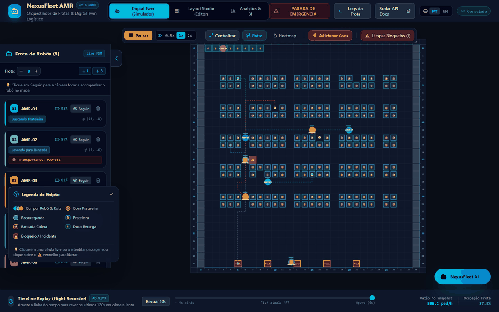
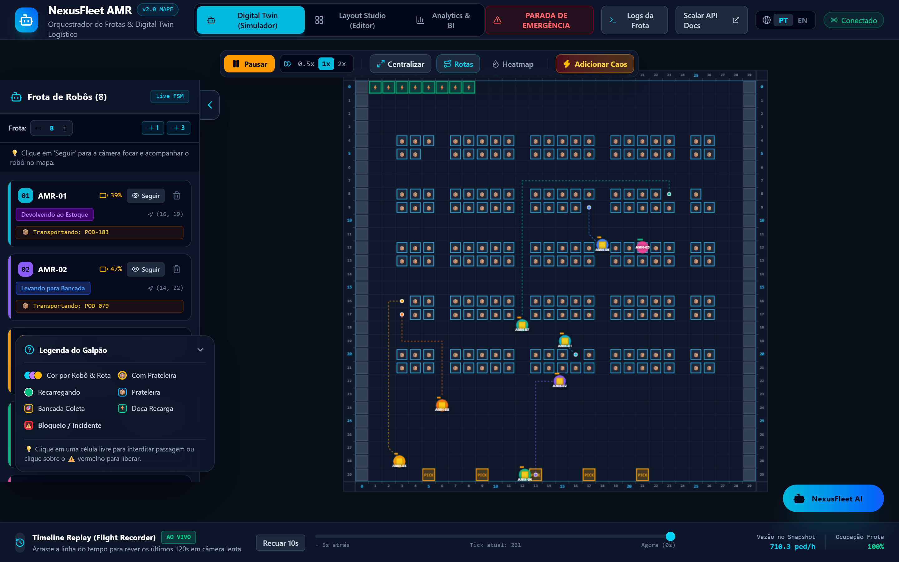
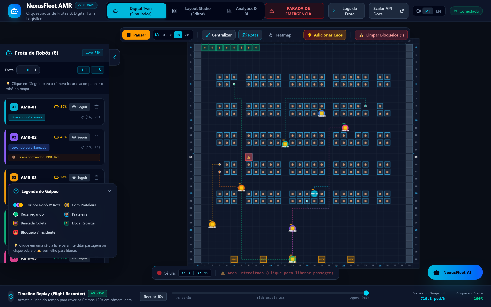
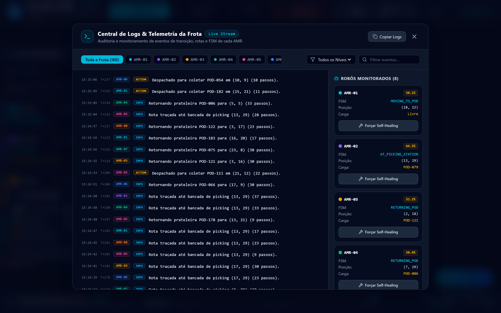
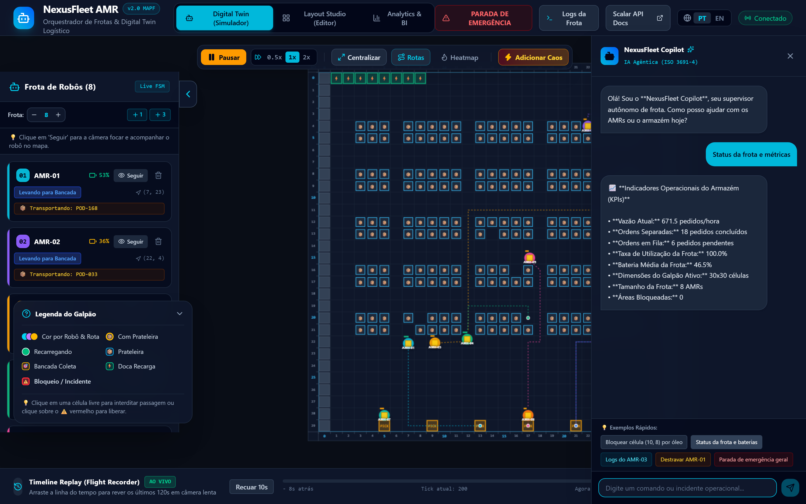
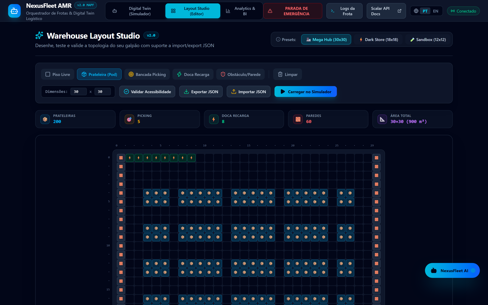
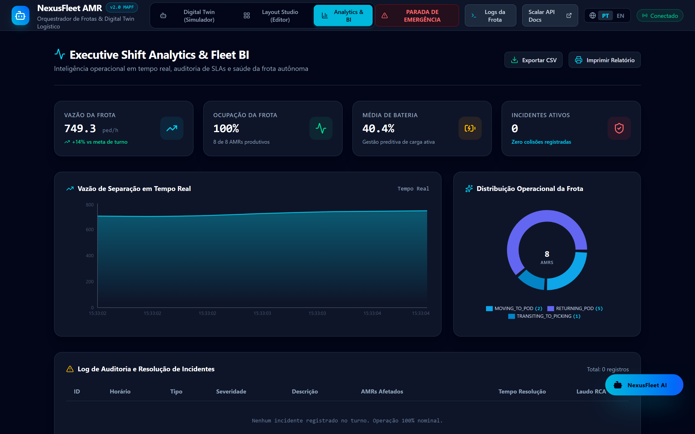
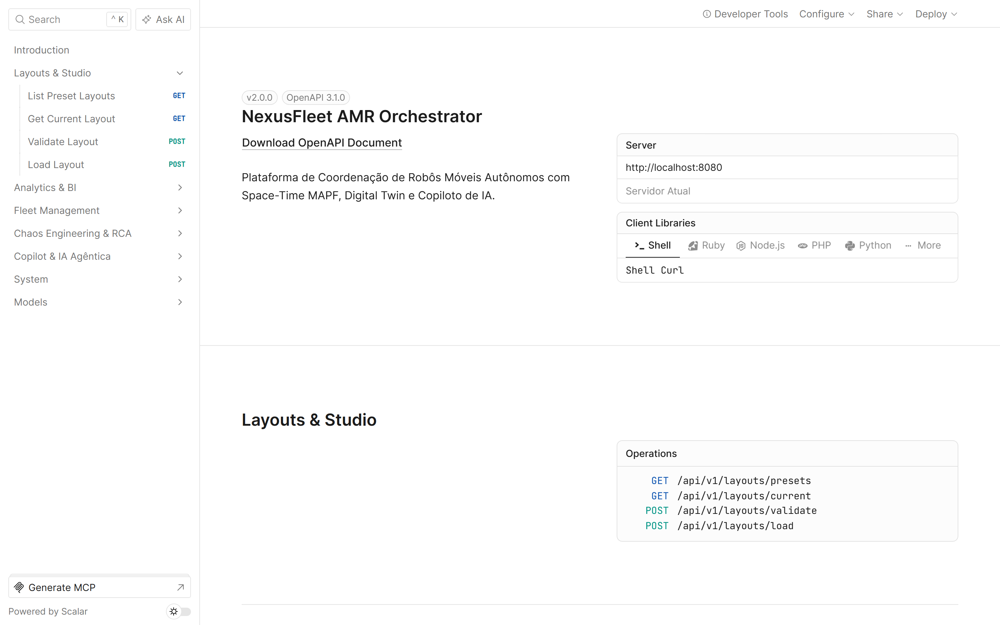
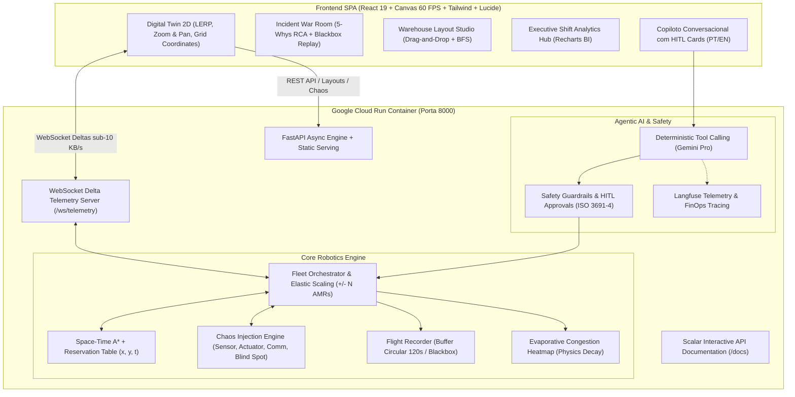

# NexusFleet AMR: Autonomous Fleet Orchestrator & Digital Twin

[](https://www.python.org/)
[](https://fastapi.tiangolo.com/)
[](https://react.dev/)
[](https://www.typescriptlang.org/)
[](https://opensource.org/licenses/MIT)
[-brightgreen.svg)]()
[](https://github.com/scalar/scalar)
[](https://ai.google.dev/)
[](https://langfuse.com/)
[-4285f4.svg)](https://cloud.google.com/run)
[](https://github.com/astral-sh/ruff)
[](http://mypy-lang.org/)

> **Status da Plataforma:** Produção Corporativa  
> **Interface Interativa:** [https://nexusfleet-amr.a.run.app](https://nexusfleet-amr.a.run.app) *(ou [http://localhost:8000](http://localhost:8000))*  
> **Documentação da API (Scalar):** [https://nexusfleet-amr.a.run.app/docs](https://nexusfleet-amr.a.run.app/docs) *(ou [http://localhost:8000/docs](http://localhost:8000/docs))*

<div align="center">
  
  <p><em>Coordenação autônoma multi-robô em tempo real via Space-Time A* MAPF com anti-colisão determinística a 60 FPS</em></p>
</div>

O **NexusFleet AMR** é uma plataforma de intralogística de padrão internacional para coordenação em tempo real de frotas de **Robôs Móveis Autônomos (AMRs)** em galpões de alta densidade (padrão *Amazon Robotics*, *Mercado Livre Fulfillment* e *Symbotic*).

O sistema integra o estado da arte em **Roteamento Espaço-Temporal Multi-Agente (Space-Time MAPF)**, um **Digital Twin interativo a 60 FPS**, um módulo de **Engenharia de Caos & RCA (Root Cause Analysis)** com reprodutor de Caixa Preta, um **Mapa de Calor Evaporativo**, um **Studio de Design de Galpões**, um **Painel de Business Intelligence** e um **Copiloto Operacional de IA Bilíngue (PT/EN)** com proteção de segurança física *Human-In-The-Loop* (ISO 3691-4).

---

## Galeria de Recursos & Screenshots

| Simulador Digital Twin 2D/3D | Telemetria & Detalhe do Robô |
|:---:|:---:|
|  |  |

| Central de Logs & Auto-Cura | Copiloto de IA com Guardrails HITL |
|:---:|:---:|
|  |  |

| Studio de Layout de Galpão (BFS) | Executive Shift Analytics & BI |
|:---:|:---:|
|  |  |

| Documentação Viva de APIs (Scalar) |
|:---:|
|  |

---

## Arquitetura do Sistema (Single-Container Full-Stack)

A aplicação é construída como um monólito conteinerizado de alta performance, sem problemas de CORS e com **custo operacional de R$ 0,00 / mês** (Google Cloud Run com Scale-to-Zero).



---

## Os 8 Grandes Diferenciais Técnicos

### 1. Space-Time Multi-Agent Path Finding (MAPF)
* Modela a malha do galpão em um grafo espaço-temporal tridimensional $(x, y, t)$.
* Através de uma **Reservation Table** com reservas atômicas de vértices e arestas, elimina matematicamente:
  * **Conflitos de Vértice:** Dois robôs tentando ocupar a mesma coordenada $(x, y)$ no mesmo segundo $t$.
  * **Conflitos de Aresta:** Robôs em sentidos opostos trocando de posição no mesmo corredor (colisão frontal).
* Suporte a espera ativa: AMRs aguardam em células de escape calculadas dinamicamente quando robôs com maior prioridade de despacho precisam de passagem.

### 2. Digital Twin a 60 FPS com Flight Recorder (Timeline Replay)
* **Render Loop Otimizado:** Desenvolvido em HTML5 Canvas nativo com `requestAnimationFrame` desacoplado do ciclo de render do React via **Zustand**.
* **Interpolação Suave (LERP):** Movimento fluido a 60 FPS interpolando coordenadas discretas dos robôs.
* **Timeline Replay (Caixa Preta):** O sistema retém os últimos 120 segundos de telemetria completa em memória. O operador pode pausar e arrastar a linha do tempo para trás (*Scrubbing*) para rever incidentes em câmera lenta (padrão *Foxglove Studio*).

### 3. Engenharia de Caos & Incident War Room (RCA 5-Whys)
* Injeção determinística de falhas operacionais para validar a resiliência do sistema:
  * **Falha de Sensor Lidar/Odometria:** Cegueira temporária gerando deriva de posição.
  * **Falha Mecânica de Atuador/Travamento:** Robô para abruptamente na rota.
  * **Blackout de Comunicação RF/Wi-Fi:** Perda de pacotes e delay de heartbeat.
  * **Colisão de Ponto Cego em Cruzamento:** Simulação física de colisão com paralisação por segurança (ISO 3691-4).
* **War Room Interativa:** Diagnóstico automático com a metodologia **5-Whys**, gravação de incidentes na auditoria e cálculo de MTTR (*Mean Time To Resolution*).
* **Self-Healing:** O orquestrador isola robôs acidentados como obstáculos dinâmicos temporários e recalcula instantaneamente as rotas de toda a frota circundante via Space-Time A*.

### 4. Escalonamento Elástico da Frota (+N / -N Robôs)
* Permite adicionar ou remover robôs em tempo de execução diretamente pela interface ou via comando em linguagem natural no Copiloto.
* **Descomissionamento Seguro:** Prioriza robôs ociosos ou em recarga; se um robô em transporte for removido, sua ordem é automaticamente devolvida à fila de prioridade e suas reservas espaço-temporais são expurgadas da Reservation Table sem gerar impasses (*deadlocks*).

### 5. Dynamic Evaporative Congestion Heatmap
* Mede a densidade de tráfego em cada corredor através de um algoritmo de decaimento evaporativo temporal:
  * Cada passagem de robô adiciona calor à célula correspondente.
  * O calor evapora suavemente a uma taxa configurável ($t_{decay}$), garantindo que o mapa reflita o tráfego recente e volte à cor normal quando os robôs se dispersam.

### 6. Warehouse Layout Studio (Editor Drag-and-Drop)
* Permite desenhar a planta baixa de um galpão com o mouse: corredores livres, prateleiras (*Pods*), bancadas de *Picking*, estações de recarga rápida e paredes.
* **Validação de Acessibilidade:** Algoritmo BFS / Flood Fill que alerta visualmente se alguma prateleira ficou isolada ou sem rota transitável.
* **Exportação e Importação:** Baixe ou carregue layouts em arquivos `.json` com 1 clique.
* Presets inclusos: *Amazon Mega Fulfillment Center (30x30)*, *Micro-Dark Store (18x18)* e *Testing Sandbox (12x12)*.

### 7. Executive Shift Analytics Hub (BI Operacional)
* Visualização executiva em tempo real com **Recharts**:
  * Curva de Throughput de separação de pedidos por hora.
  * Gráfico de rosca dinâmico com a distribuição de estados da frota (`Picking`, `Trânsito`, `Recarga`, `Ocioso`, `Crashed`).
  * Tabela de auditoria de incidentes com badges de severidade e tempo de resolução.
  * Exportação de dados operacionais em **.CSV** e impressão de relatórios de turno.

### 8. Copiloto de IA Bilíngue com Guardrails HITL (ISO 3691-4)
* Supervisor operacional integrado que opera sob **Tool Calling Determinístico**: o modelo de linguagem gerencia a frota chamando ferramentas tipadas com Pydantic v2 (`block_warehouse_zone`, `scale_fleet`, `emergency_stop_fleet`, `get_fleet_telemetry`), sem alucinar trajetórias geométricas.
* **Human-In-The-Loop (HITL):** Comandos com potencial destrutivo (como paralisar a frota de robôs) geram um cartão de confirmação explícito na interface antes da execução física.
* **Observabilidade:** Monitoramento de latência, tokens e traces via **Langfuse**.
* **Suporte Bilíngue Nativo:** Toggle instantâneo entre **Português (Padrão)** e **Inglês**.

---

## Como Executar Localmente

### Pré-requisitos
* Python 3.12+ e [uv](https://docs.astral.sh/uv/) instalado
* Node.js 20+ e npm

### 1. Clonar o Repositório
```bash
git clone https://github.com/henriquebotelhogomes/warehouse_routing.git
cd warehouse_routing
```

### 2. Instalar Dependências e Compilar Frontend
```bash
# Instala dependências backend via uv
uv sync

# Compila o frontend React 19 para produção
cd frontend
npm install
npm run build
cd ..
```

### 3. Iniciar o Servidor Integrado
```bash
uv run python run.py
```
*(Ou alternativamente via uvicorn: `uv run uvicorn warehouse_routing.api.main:app --host 0.0.0.0 --port 8000`)*

Acesse no seu navegador:
* **Digital Twin & Plataforma:** [http://localhost:8000](http://localhost:8000)
* **Documentação Interativa da API (Scalar):** [http://localhost:8000/docs](http://localhost:8000/docs)

---

## Suíte de Testes e Qualidade

```bash
# Executar todos os testes unitários e de integração (20 testes passando - 100%)
uv run pytest tests/ -v

# Verificação estática de tipos
uv run mypy src/

# Linter e formatação de código
uv run ruff check src/ tests/
uv run ruff format src/ tests/
```

---

## Deploy no Google Cloud Run (Custo R$ 0,00 / Mês)

O projeto foi arquitetado para aproveitar a cota **Always Free** do Google Cloud Run (2 milhões de requisições mensais gratuitas com Scale-to-Zero).

```bash
# Deploy automatizado em 1 comando:
./deploy_gcp.sh       # No Linux/macOS
./deploy_gcp.ps1      # No Windows PowerShell
```

---

## Licença

Distribuído sob a licença **MIT**. Consulte o arquivo [`LICENSE`](LICENSE) para obter mais informações.

---

## Autor

**Henrique Botelho Gomes**  
*Engenheiro de Software Sênior | Especialista em IA Aplicada & Sistemas Distribuídos*  
* LinkedIn: [linkedin.com/in/henriquebotelhogomes](https://linkedin.com/in/henriquebotelhogomes)  
* GitHub: [github.com/henriquebotelhogomes](https://github.com/henriquebotelhogomes)
